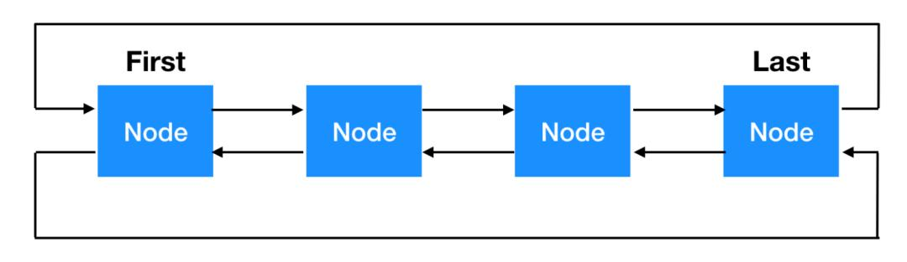
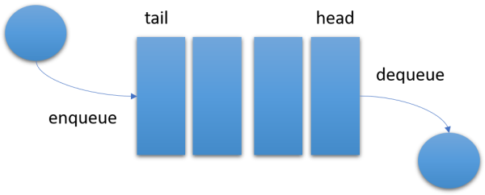
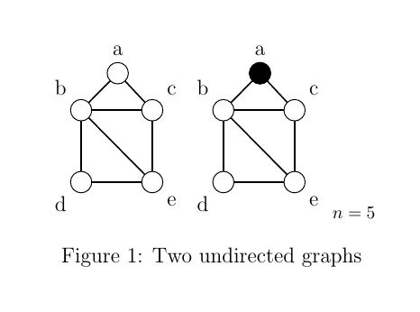

# Data Structures 
<ul align="center" type="none" style=" display: flex;
          flex-direction: row-reverse;">
<li>
   <h3>  <a href="#linklist">  Linked List  </a></h3>
    </li>
    <li type="♾️">
       <h3> <a href="#stack"> Stack  </a></h3>
    </li>
    <li>
      <h3>   <a href="#queue">Queue </a></h3>
    </li>
    <li>
        <h3> <a href="#graph"> Graph </a></h3>
    </li>
</ul>

<ul type="none">
<li  id="linklist" align="center">
<h2>
    <a title="Go to code" href="./_linkedList.py">
        Linked List
    </a>
</h2>
 

</li>
   

<li  id="stack" align="left">
    <h2>
        <a title="Go to code" href="./_stack.py"> Stack</a>
        </h2>
         
        
        

</li>
   

<li  id="queue" align="right">
    <h2>
        <a title="Go to code" href="./_queue.py"> Queue</a>
        </h2>
         
        
        

</li>

<li align="center" id="graph">
    <h2>
        <a title="Go to code" href="./_graph.py"> Graph</a>
        </h2>
         
        
        

</li>
</ul>
