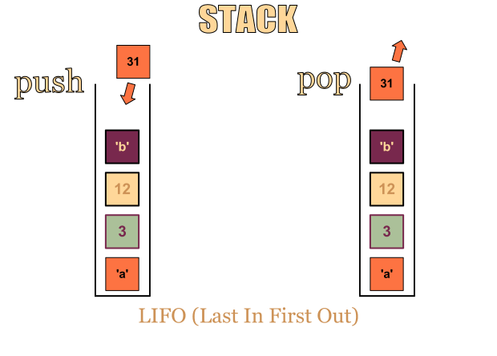

# Data Structures 

<ul type="none">
<li>
<h2>
    <a href="./_linkedList.py">
        Linked List
    </a>
</h2>
 

</li>

<li>
    <h2>
        <a href="./_stack.py"> Stack</a>
        </h2>
         
        
        

</li>

<li>
    <h2>
        <a href="./_queue.py">
           Queue
        </a>
    </h2>
         
        
        

</li>

<li>
    <h2>
        <a href="./_graph.py"> Graph</a>
       
        </h2>
         
        
        

</li>

</ul>